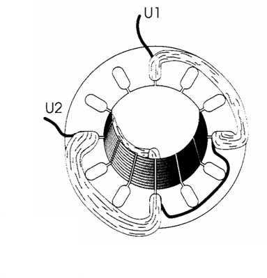

# The asynchronous motor

A good knowledge of motor operation is required to understand how to control it.
A brief repetition of the operation clearly shows how we can do this.

An electric motor seems simple at first glance. What happens in the motor is the following:
The motor extracts energy from the electricity grid and converts it into a rotating (mechanical) movement by means of a magnetic field and induction.

We can use this rotating movement to drive tools (for example: fans, conveyor belts).

## The rotating field

When we connect the coils to a three-phase network, currents are created in the three coils which are shifted 120° relative to each other.

 

This creates a magnetic rotating field in the stator.

## Influence of the number of pole pairs

An electric motor has three coils as standard. There are also motors with multiple sets of three coils. In order to make a full rotation, these need multiple voltage sine waves.

## The rotor

The magnetic field lines of the stator’s  rotating field cut the rotor’s conductors and develop a voltage in them.

These conductors are short-circuited front and rear, creating a short-circuit current which in turn develops an electromagnetic force around the rotor’s conductors.
Together with the magnetic field in the stator, the magnetic field in the rotor creates the torque that makes the electric motor run.

The magnetic field of the stator always rotates faster than the rotor. 
The difference in speed between the magnetic field in the stator and the rotor is called slip. Because of this slip, a voltage and a corresponding current is generated in the rotor and resulting forces continue to be developed. 

More axle load gives more slip, more slip gives more rotor current, more rotor current gives more electromagnetic force and therefore more torque.

This is a typical diagram for motors  of the asynchronous short-circuit anchor type.