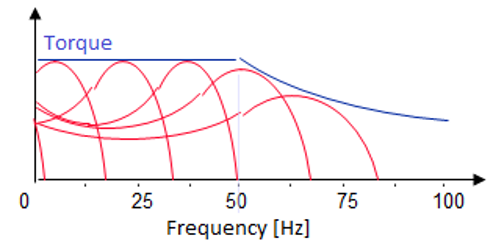
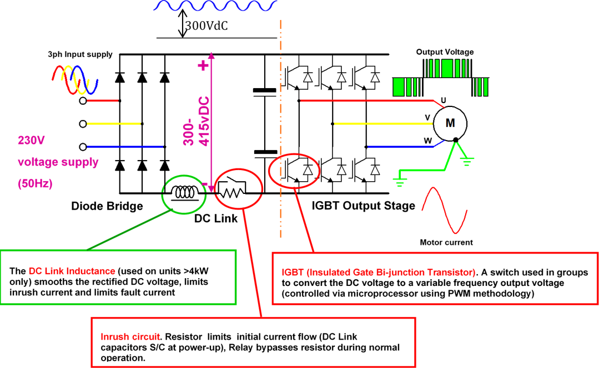
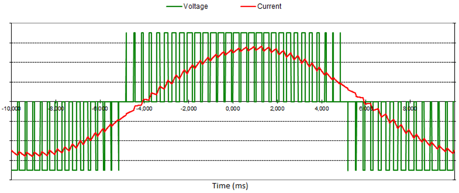
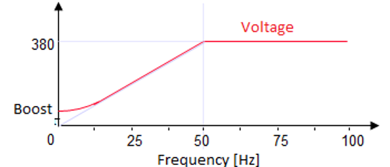
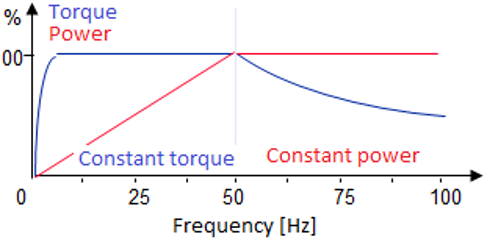
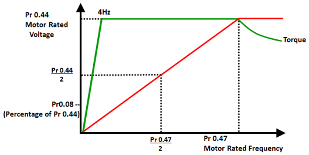
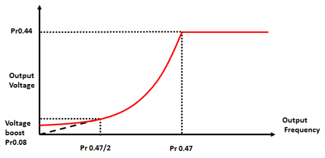
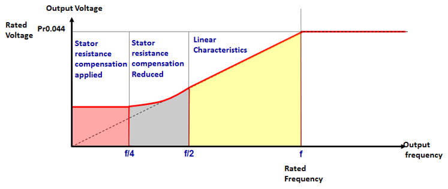
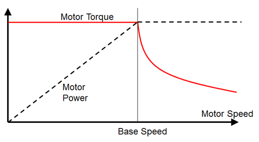

# General operation of the control system

By controlling the frequency, the speed of the rotating field and thus the rotor speed is controlled.

## Principle of the motor controller

A single phase or a three-phase power supply is first rectified to DC and will next be converted back to three-phase alternating current at the desired speed.

## Pulse Width Modulation

The IGBT's are controlled with a frequency anywhere between 2 and 16kHz.
The higher the frequency, the quieter the motor runs, but the less mechanical power it can generate.

## V/f

In order to avoid magnetic saturation, the voltage is kept proportional to the frequency. Because of this, the magnetic flux is constant and so is the torque.

At low frequency, the ratio between resistance and inductance is different than at 50Hz. For this purpose, an extra boost voltage is applied.

As long as the magnetic flux remains constant, the torque will also remain constant.

At line frequency (50Hz) we have the full supply voltage. It is electronically possible to make the frequency higher. However, the voltage cannot follow. 

Running the motor faster than the grid frequency is at the expense of the torque.

## Different modes of operation

### Open loop with fixed V/f mode: standard use with a fixed boost

100% torque is available from 4 Hz.

### Open loop with quadratic V/f mode: applied at large moments of inertia (e.g. for fans)

Energy saving but with limited starting torque.

### Open loop with vector mode: flux optimisation

The torque is 100% available from 1Hz. In this mode it is possible to make slip compensation and the motor speed no longer depends on the load.

### Rotor Flux Control (RFC-A)

The Drive uses an internal algorithm without encoder feedback for very stable and accurate speed control at high available motor torque.

